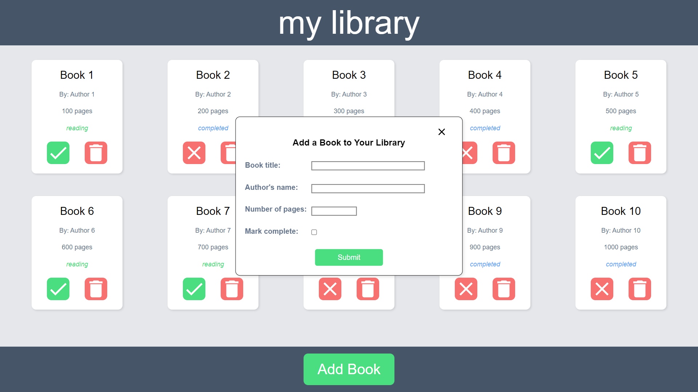

# Library

## Overview

This project is a simple library application built using HTML, CSS, and JavaScript. It allows users to manage their personal library by adding, removing, and updating books.

## Screenshot

You can also view a live demo of the project [here](https://wilsonliu2.github.io/library-project/).

## Technologies Used

- HTML
- CSS
- JavaScript
